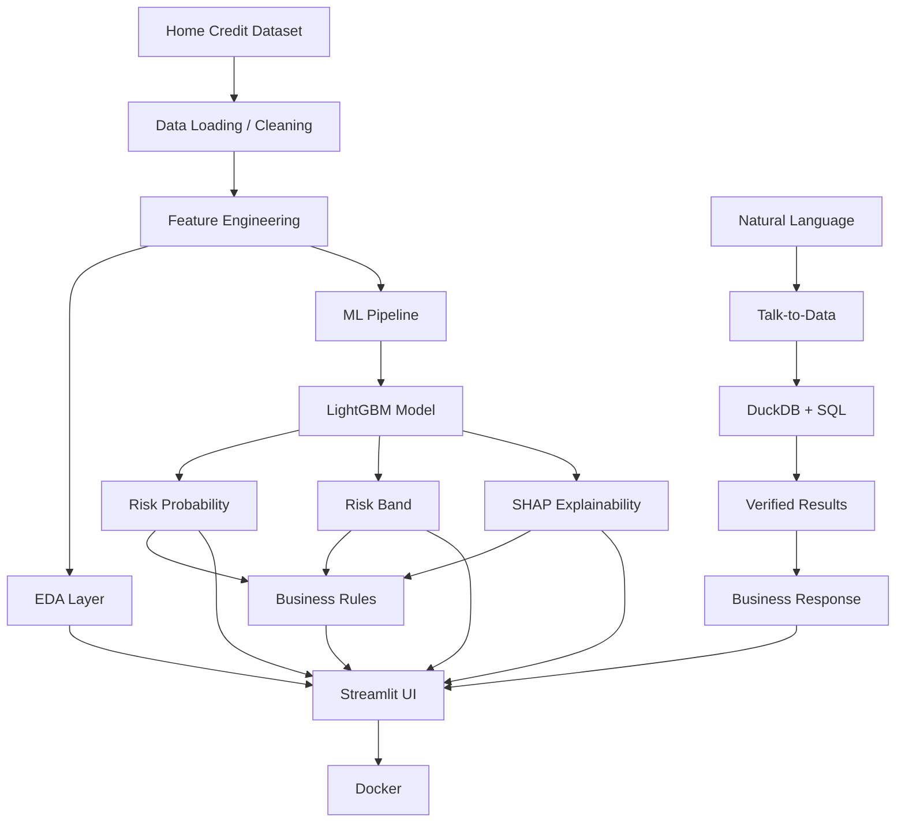

# AI-Powered Credit Risk Intelligence Platform

## Project Overview

The **AI-Powered Credit Risk Intelligence Platform** is an end-to-end analytical decision-support system built on the Home Credit Default Risk dataset. It empowers financial institutions and risk analysts to identify applicants with a higher probability of loan default through a transparent, explainable, and interactive workflow. 

The platform combines robust data engineering, an optimized LightGBM machine learning pipeline, SHAP-based explainability, descriptive business rules, and a natural-language "Talk-to-Data" interface powered by a secure DuckDB SQL layer. All of these capabilities are surfaced through a professional Streamlit dashboard and seamlessly packaged for deployment using Docker.

---

## 1. Problem Statement

Financial institutions face the critical challenge of identifying loan applicants who have a higher probability of default, a task complicated by imbalanced data and complex historical patterns. While black-box machine learning models can achieve high predictive performance, modern regulatory and business environments demand transparent, explainable, and auditable decision support.

This platform addresses this by providing:
- Estimated default probability and a scaled risk score.
- Categorical Low/Medium/High risk bands.
- Feature-level SHAP explanations for individual predictions.
- Descriptive, business-readable rules derived from historical portfolios.
- Natural-language data exploration (Talk-to-Data) for rapid portfolio analysis.
- Visual EDA and an intuitive analyst UI.

**Important:** This is a decision-support system designed to assist analysts. It is **NOT** an autonomous lending approval/rejection system.

---

## 2. Business Objectives

The project successfully implements the following core objectives:
1. Understand applicant demographics, historical credit behaviour, and financial data.
2. Identify important portfolio-level risk patterns through EDA.
3. Predict the probability of loan default for individual applicants.
4. Explain individual model predictions transparently.
5. Convert model and data findings into interpretable, business-readable rules.
6. Allow analysts to ask natural-language questions about the portfolio data.
7. Provide an easy-to-use, professional user interface.
8. Package the platform using Docker for robust, reproducible deployment.

---

## 3. Dataset

The system is built upon the **Home Credit Default Risk dataset**. The raw data captures a wealth of applicant demographics and historical financial behaviours.

**Core Files:**
- `application_train.csv` & `application_test.csv`
- `bureau.csv` & `bureau_balance.csv`
- `previous_application.csv`
- `installments_payments.csv`
- `POS_CASH_balance.csv`
- `credit_card_balance.csv`

**Data Architecture & Relationships:**
The data is intrinsically relational, centered around the applicant ID (`SK_ID_CURR`).
```text
SK_ID_CURR
    |
    +-- bureau
    |      |
    |      +-- bureau_balance
    |
    +-- previous_application
           |
           +-- installments_payments
           +-- POS_CASH_balance
           +-- credit_card_balance
```

**Portfolio Metrics:**
- **Total Applicants:** 307,511
- **Actual Defaults:** 24,825
- **Overall Default Rate:** 8.07%

---

## 4. System Architecture



---

## 5. Project Structure

The project is organized into modular directories ensuring separation of concerns between data, machine learning, application logic, and deployment.

```text
credit_risk_platform/
├── data/              # Raw datasets and DuckDB database (credit_risk.duckdb)
├── documents/         # Generated EDA charts, SHAP plots, evaluation metrics, and rules
├── notebooks/         # Jupyter notebooks for data quality, EDA, and exploration
├── src/               # Application source code
│   ├── data/          # Data loaders and preprocessors
│   ├── ml/            # Training, prediction, evaluation, explainability, and rules logic
│   ├── talk_to_data/  # LLM prompts, NL-to-SQL logic, DuckDB query runner, and SQL validation
│   ├── utils/         # Helper functions, config, and logging
│   └── ui/            # Streamlit dashboard implementation (app.py)
├── sql/               # SQL schema definitions
├── models/            # Trained LightGBM model, feature metadata, and processed application_features.csv
├── Dockerfile         # Docker image configuration
├── docker-compose.yml # Container orchestration
├── requirements.txt   # Locked Python dependencies
├── .env.example       # Environment variable placeholders
├── .gitignore         # Git ignore rules
└── README.md          # Project documentation
```

---

## 6. Data Understanding and EDA

Extensive exploratory data analysis was conducted to understand distributions, missing values, duplicates, and financial relationships. 

**Key Observational Findings:**
- **Target Imbalance:** The target is highly imbalanced, with ~91.93% non-default and ~8.07% default.
- **Age:** Younger applicants showed higher observed default rates.
- **External Scores:** External credit scores showed strong relationships with observed default rates.
- **Employment:** Longer employment duration was associated with lower observed default rates.
- **Education:** Education categories showed notably different observed default rates.
- **Credit-to-Income:** Income and credit amount relationships were less straightforward and included nonlinear patterns.
- **Fairness:** Gender showed an observed difference but was excluded from the model as a fairness-conscious modeling choice.

| Insight | Evidence | Business Interpretation |
|---|---|---|
| Age Risk | Higher default density in 20-30 age bracket | Younger applicants may have less credit history |
| External Sources | Strong negative correlation with TARGET | Historical third-party ratings are robust predictors |
| Employment | Default rate drops as tenure increases | Stable employment signals repayment capacity |

*Note: These insights reflect observational historical patterns and do not claim causality.*

Relevant visualizations are stored in `documents/eda/` (e.g., `01_target_distribution.png`, `02_default_by_age.png`, `05_ext_source_1_default.png`).

---

## 7. Data Quality and Preprocessing

The preprocessing pipeline rigorously handles data anomalies, missing values, and relationship aggregations.

**Key Transformations:**
- **Anomalies:** The `DAYS_EMPLOYED` anomaly (value `365243`) was replaced with `NaN` to prevent model distortion.
- **Missing Values & Categoricals:** Missing numericals were handled natively by LightGBM, and categoricals were cast appropriately.
- **Date/Duration:** Days were converted to absolute years (e.g., `AGE_YEARS`, `EMPLOYMENT_YEARS`).

**Engineered Financial Ratios:**
- `CREDIT_INCOME_RATIO`
- `ANNUITY_INCOME_RATIO`
- `CREDIT_GOODS_RATIO`

**Historical Aggregates (Engineered from secondary tables):**
- **Bureau:** `BUREAU_ACCOUNT_COUNT`, `BUREAU_TOTAL_CREDIT`, `BUREAU_TOTAL_DEBT`, `BUREAU_TOTAL_OVERDUE`
- **Previous Apps:** `PREV_APPLICATION_COUNT`, `PREV_APPROVED_COUNT`, `PREV_APPROVAL_RATE`
- **Installments:** `INSTALLMENT_COUNT`, `LATE_PAYMENT_COUNT`, `LATE_PAYMENT_RATE`, `AVG_PAYMENT_DELAY`
- **POS/Credit Card:** `POS_LATE_RECORD_COUNT`, `POS_MAX_DPD`, `CC_AVG_UTILIZATION`, `CC_LATE_RATE`
- **Availability Flags:** `HAS_BUREAU_HISTORY`, `HAS_PREVIOUS_APPLICATION`, etc.

---

## 8. Machine Learning Model

The predictive engine is a LightGBM binary classifier (`LGBMClassifier`), chosen for its native handling of categorical features, missing values, and speed on large datasets.

**Configuration:**
- `objective`: `binary`
- `n_estimators`: `500`
- `learning_rate`: `0.05`
- `num_leaves`: `31`
- `max_depth`: `-1`
- `subsample`: `0.8`
- `colsample_bytree`: `0.8`
- `reg_alpha`: `0.1`
- `reg_lambda`: `0.1`
- `random_state`: `42`
- `class_weight`: `balanced`

**Why `class_weight="balanced"`?**
Given the severe target imbalance (8.07% defaults), a balanced class weight ensures the model aggressively penalizes false negatives, learning the minority class patterns effectively without requiring manual SMOTE oversampling.

---

## 9. Model Evaluation

Because accuracy is misleading on highly imbalanced datasets, ROC-AUC and Precision-Recall metrics were prioritized. 

**Final Validation Metrics:**
- **ROC-AUC:** 0.7762
- **Average Precision:** 0.2727
- **Accuracy:** 0.7496
- **Precision at 0.50:** 0.1919
- **Recall at 0.50:** 0.6548
- **F1 at 0.50:** 0.2969

**Confusion Matrix (Threshold 0.50):**
- **TN:** 42,851 | **FP:** 13,687
- **FN:** 1,714 | **TP:** 3,251

**Risk Band Analysis & Calibration:**
Threshold selection depends heavily on business objectives (identifying defaults vs. reducing false positives). The portfolio is segmented as follows:
- **Low Risk:** 28,085 applicants | 2.44% observed default rate
- **Medium Risk:** 22,504 applicants | 7.61% observed default rate
- **High Risk:** 10,914 applicants | 23.51% observed default rate

---

## 10. Risk Scoring

The raw LightGBM probability is transformed into interpretable scores:
- **Default Probability:** The raw predicted probability of `TARGET=1`.
- **Risk Score:** `Probability * 100` (0-100 scale).

**Risk Bands:**
- **Low Risk:** < 30% probability
- **Medium Risk:** 30% to < 60% probability
- **High Risk:** >= 60% probability

*Disclaimer: This score represents model-estimated risk based on historical correlations, not absolute certainty of default.*

---

## 11. Explainable AI (SHAP)

To provide transparency, the system utilizes SHAP (SHapley Additive exPlanations) via `TreeExplainer` for applicant-level explanations.

- **Positive SHAP Value:** Increases predicted risk.
- **Negative SHAP Value:** Decreases predicted risk.
- **Business Translation:** Technical feature names (e.g., `EXT_SOURCE_1`) are mapped to business-readable labels (e.g., `External Credit Score 1`).

**Artifact Example:**
For Applicant `100002` (High Risk / 84.12% probability), the model generated `documents/shap/applicant_100002_shap.csv` and a corresponding bar chart. Top contributors cleanly show how low external credit scores heavily push predictions toward higher risk.

---

## 12. Business Risk Rules

The platform extracts descriptive rules directly from historical associations, surfacing them in `documents/rules/business_risk_rules.csv`.

**Categories:**
- **External Credit Signals:** Strongest relationship with historical default rates.
- **Employment Duration:** Longer tenure signals stability.
- **Age Patterns:** Higher relative risk in younger applicants.
- **Repayment Behaviour:** Historical late payments indicate elevated future risk.

**Important Safety Language:**
*These rules are descriptive decision-support rules derived from historical associations. They are NOT autonomous approval/rejection rules and should not be used as the sole basis for lending decisions. Protected attributes must undergo rigorous fairness evaluation before any production deployment.*

---

## 13. Talk-to-Data

The Talk-to-Data feature allows analysts to query the credit portfolio securely using plain English. It accounts for **25% of the evaluation requirements** and features a robust, hallucination-resistant pipeline.

**Execution Flow:**
`Natural-language question` → `LLM` → `SQL generation` → `SQL validation` → `DuckDB` → `Verified result` → `Business-readable response`

**Safety & Validation Controls:**
- **Analytical Layer:** DuckDB is utilized for rapid analytical queries.
- **SQL Sanitization:** Only `SELECT`/`WITH` statements are permitted. Mutations (DROP/DELETE/UPDATE/INSERT/ALTER) are strictly blocked.
- **Allowed Tables:** Queries are restricted to the validated `applicants` schema.
- **Exact Column Matching:** Ensures the LLM does not hallucinate non-existent features.
- **Unsupported Queries:** The prompt rigorously instructs the LLM to return `UNSUPPORTED_QUERY` if the data cannot answer the question. The response generator treats the verified DB results as authoritative and refuses to invent numbers.

---

## 14. Talk-to-Data Query Examples

The following queries have been tested and verified against the DuckDB analytical layer:

1. *"What percentage of applicants defaulted?"*
2. *"What is the default rate by education type?"*
3. *"What is the default rate by age group?"*
4. *"What is the average income of applicants who defaulted?"*
5. *"Which occupation types have the highest default rates?"*

**Hallucination Control Test:**
- *"What is the average number of mobile phone calls made by applicants?"* → Properly routed to the `UNSUPPORTED_QUERY` exception block, safely replying: *"I can't answer that question using the currently available applicant data."*

---

## 15. Prompt Engineering

Advanced prompt-engineering techniques were utilized to ensure stability and accuracy:
- **Schema Grounding:** Injecting exact table and column names into the system prompt.
- **Strict Guardrails:** Explicit instructions to output *only* raw SQL without markdown blocks or conversational padding.
- **Semantic Definitions:** Distinguishing clearly between raw model probabilities, TARGET=1 semantics, and risk-band definitions.
- **No Hallucinations:** Directives preventing the invention of unsupported fields or analytical claims.

---

## 16. Conversational Memory

The Streamlit UI implements a lightweight conversational memory using `st.session_state`. It retains recent conversation turns during the active browser session to improve conversational continuity (e.g., asking *"What about by education?"* after a previous question). This memory is strictly ephemeral and does not persist sensitive data across users or system restarts.

---

## 17. Streamlit UI

The user interface, located in `src/ui/app.py`, provides a polished, responsive dashboard tailored for credit analysts. 

**Core Sections:**
1. **Overview:** Executive KPI metrics, model performance, and high-level risk band summaries.
2. **EDA & Portfolio Insights:** Presents visual portfolio patterns and business insights.
3. **Risk Prediction:** Allows analysts to select an applicant ID, calculates LightGBM predictions dynamically, and displays formatted risk scores.
4. **Explainability:** Renders SHAP bar charts and dataframes explaining exact factors influencing the prediction.
5. **Business Rules:** Displays the derived tabular risk signals.
6. **Talk to Data:** An interactive chat interface backed by the DuckDB NL-to-SQL pipeline, complete with expandable execution details (SQL and raw dataframes).

---

## 18. Docker Deployment

The application is fully containerized for seamless, reproducible deployments, circumventing the need for complex local python environments.

**Implementation Details:**
- **Dockerfile:** Utilizes `python:3.10-slim` as a lightweight base.
- **docker-compose.yml:** Defines a single service mapping Streamlit to host port `8501`.
- **.dockerignore:** Prevents gigantic raw CSV datasets from blooming the image size, while safely copying over `credit_risk.duckdb` and necessary `models/`.

**Commands:**
```bash
# Build and start the container in the background
docker compose up --build -d

# Stop and remove the container
docker compose down
```
Once started, access the dashboard at: **http://localhost:8501**

---

## 19. Environment Configuration

Environment secrets are managed securely. The repository includes `.env.example` as safe documentation.

```env
# LLM Configuration
LLM_API_KEY=
LLM_MODEL=

# Application
APP_NAME=Credit Risk Intelligence Platform

# Data & Models
DATA_PATH=data
MODEL_PATH=models
```
*Never commit your actual `.env` file containing real API keys.*

---

## 20. Installation / Local Setup

**Method 1: Docker (Recommended)**
1. Clone the repository.
2. Copy `.env.example` to `.env` and fill in your `LLM_API_KEY`.
3. Run `docker compose up --build -d`.
4. Open `http://localhost:8501`.

**Method 2: Local Python Environment**
1. Clone the repository.
2. Create a virtual environment: `python -m venv venv` and activate it.
3. Install dependencies: `pip install -r requirements.txt`.
4. Copy `.env.example` to `.env` and configure your API key.
5. Ensure `models/application_features.csv`, `models/credit_risk_lightgbm.pkl`, and `data/credit_risk.duckdb` are present.
6. Run the application: `python -m streamlit run src/ui/app.py`.

---

## 21. Testing and Validation

The platform has undergone strict integration and logical testing:
- **Data Integrity:** Validated duplicate handling, missing value treatments, and relationship aggregations.
- **Model Constraints:** Verified ROC-AUC scores against class imbalance controls.
- **Risk Inference:** Verified pipeline logic mapping probabilities to strictly defined Risk Bands.
- **SQL Validation:** Tested SQL query guardrails to ensure `DROP`/`UPDATE` requests are rejected.
- **Talk-to-Data:** Passed 5 standard analytical queries and successfully identified unsupported queries.
- **Docker Build:** Tested container orchestration and port exposure.

---

## 22. Limitations

- **Historical Confounding:** Observational relationships in EDA do not establish causality.
- **Class Imbalance:** Identifying the 8% minority class perfectly is mathematically improbable; false positives are inevitable and require business-level threshold calibration.
- **LLM Nuances:** While heavily guardrailed, NL-to-SQL logic requires continual monitoring as user phrasing can be unpredictable.
- **Fairness:** The dataset may not represent current population distributions; regulatory fairness audits must be conducted prior to real-world usage.

---

## 23. Future Improvements

- **Threshold Optimization:** Shift from static 0.30 / 0.60 thresholds to dynamic optimization based on actual business cost matrices (Cost of FP vs. Cost of FN).
- **Fairness & Bias Evaluation:** Implement rigorous disparate impact testing across demographic cohorts.
- **Production Database:** Migrate from local DuckDB files to a managed warehouse (e.g., Snowflake, BigQuery).
- **Model Drift Monitoring:** Implement automated drift detection on incoming data streams.
- **Human-in-the-Loop:** Add feedback mechanisms in the UI for analysts to manually flag inaccurate LLM SQL responses.

---

## 24. Security and Responsible AI

- **Secrets Management:** API keys are restricted to local environment variables.
- **SQL Injection Prevention:** Strong regex boundaries and AST checks prevent data mutation.
- **Transparent Decisions:** SHAP clearly delineates the exact logic behind every risk score.
- **Decision Support:** The platform explicitly positions itself as an augmentative tool for human analysts, rather than an autonomous credit approval system, adhering to Responsible AI guidelines.

---

## 25. Key Results Summary

| Area | Result |
|------|--------|
| **Dataset** | 307,511 Applicants |
| **Observed Default Rate** | 8.07% |
| **Model** | LightGBM |
| **ROC-AUC** | 0.7762 |
| **Average Precision** | 0.2727 |
| **Explainability** | SHAP (`TreeExplainer`) |
| **SQL Engine** | DuckDB |
| **NL-to-SQL / Chat** | Implemented & Guardrailed |
| **UI Framework** | Streamlit |
| **Deployment** | Docker & Docker Compose |

---

## 26. Conclusion

The **AI-Powered Credit Risk Intelligence Platform** successfully bridges the gap between raw financial data and actionable business insights. By synthesizing robust Data Engineering, an optimized Machine Learning pipeline, Explainable AI (SHAP), and an interactive LLM-powered Natural Language SQL interface, the system provides credit analysts with a comprehensive, transparent, and highly accessible decision-support environment. 
